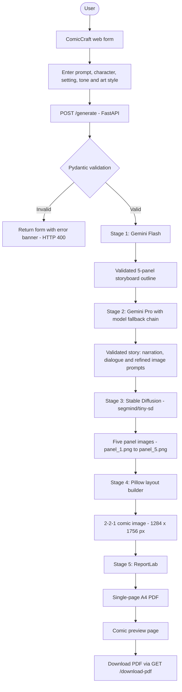
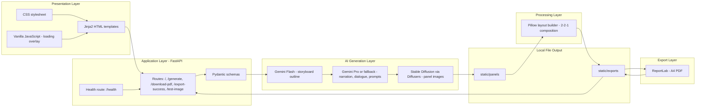
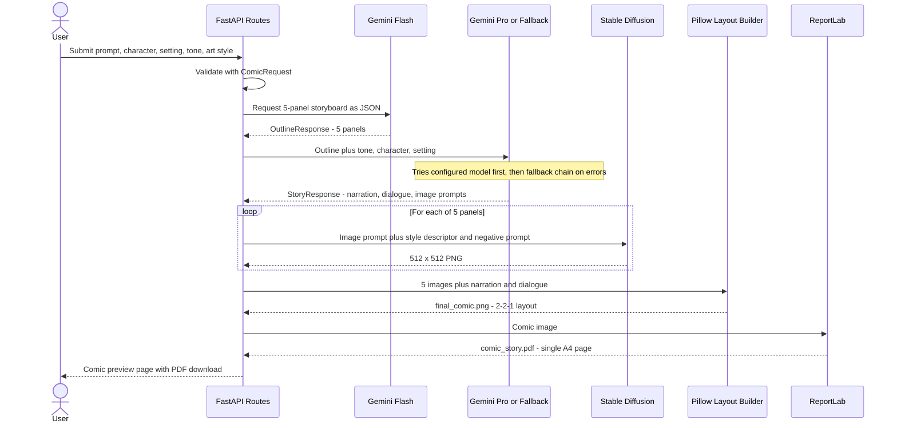

# ComicCraft — AI Comic Story Creator

<p align="center">
  <strong>From a one-line idea to a finished five-panel comic</strong>
  <br />
  A web-based, multi-stage generative AI pipeline powered by Google Gemini models, Stable Diffusion, FastAPI, Pillow, and ReportLab.
</p>

ComicCraft is a web application that turns a short story idea into a complete comic strip. The user supplies a story prompt, a main character, a setting, a tone, and an art style. ComicCraft then uses **Google Gemini** to plan and script a five-panel story, **Stable Diffusion** (via Hugging Face Diffusers) to illustrate each panel, **Pillow** to compose the panels into a 2-2-1 comic layout with captions and dialogue, and **ReportLab** to export the result as a single-page A4 PDF.

> **Generation note:** AI-generated stories and images vary from run to run, even for the same inputs. Story generation depends on Gemini API access, quota, and model availability; image generation depends on the local Stable Diffusion setup and hardware. Output quality, character appearance, and generation time are not guaranteed.

---

## Contents

- [Why ComicCraft?](#why-comiccraft)
- [Problem Statement](#problem-statement)
- [Objectives](#objectives)
- [Features](#features)
- [User Inputs](#user-inputs)
- [Application Workflow](#application-workflow)
- [System Architecture](#system-architecture)
- [AI Pipeline](#ai-pipeline)
- [Example AI Data Flow](#example-ai-data-flow)
- [Technology Stack](#technology-stack)
- [Repository Structure](#repository-structure)
- [Key Files](#key-files)
- [Getting Started](#getting-started)
- [Environment Configuration](#environment-configuration)
- [Run Locally](#run-locally)
- [API Routes](#api-routes)
- [Testing](#testing)
- [Performance Observations](#performance-observations)
- [Error Handling and Fallbacks](#error-handling-and-fallbacks)
- [Sample Outputs](#sample-outputs)
- [Demo Video](#demo-video)
- [Current Limitations](#current-limitations)
- [Future Enhancements](#future-enhancements)
- [SDC Documentation](#sdc-documentation)
- [Team and Academic Information](#team-and-academic-information)
- [Disclaimer](#disclaimer)

---

## Why ComicCraft?

Creating even a short comic traditionally involves many separate stages:

- Story ideation
- Scripting and pacing into sequential beats
- Narration and dialogue writing
- Visual prompt or art direction creation
- Illustration
- Panel composition and lettering
- Preparing a final shareable document

For students, educators, writers, and hobbyists, each of these stages demands a different skill, and the combined effort can be time-consuming or costly.

General-purpose tools only cover part of the workflow. A chatbot can write a story, but it does not produce panels, lettering, or a page layout. A standalone image generator can produce pictures, but they are disconnected from a story's progression and from dialogue and captions.

ComicCraft brings these stages into a single AI-assisted workflow: one form in, one comic strip and PDF out.

## Problem Statement

Producing a comic requires both **narrative skills** (structuring a story, writing narration and dialogue) and **visual skills** (illustrating consistent scenes, lettering text, and arranging panels on a page). Most people have only some of these skills, and existing AI tools address them in isolation rather than as one connected process.

The problem addressed by ComicCraft is:

> *How can a user go from a simple story idea to a complete, readable, printable comic strip without manually scripting, illustrating, and laying out every panel?*

## Objectives

- Accept a small set of creative inputs (prompt, character, setting, tone, art style) through a simple web form.
- Use Gemini Flash to turn the idea into a structured five-panel storyboard with schema-validated output.
- Use a second Gemini stage (Gemini Pro, with model fallback) to add narration, dialogue, and refined image prompts to each panel.
- Generate one illustration per panel with Stable Diffusion using the selected art style.
- Compose the five illustrations, narration, and dialogue into a single 2-2-1 comic layout.
- Export the comic as a downloadable single-page A4 PDF.
- Keep the pipeline resilient with model fallbacks and input validation.
- Provide automated tests for the core components.

---

## Features

### 📝 Story Creation
- Accepts a free-text story prompt.
- Produces a complete five-panel story with a title, narration, and dialogue for each panel.
- Validates every AI response against Pydantic schemas so the pipeline always receives exactly five numbered panels.

### 🎭 Character and Story Configuration
- Main character name and setting are included in the generation prompts.
- Five curated tones: **Funny, Adventure, Dramatic, Inspirational, Mystery**. The selected tone steers narration and dialogue.
- Four curated art styles: **Manga, Anime, American, Belgian**.

### 🧠 AI Story Structuring
- **Stage 1 (Gemini Flash):** creates a five-beat storyboard outline in JSON, with a panel number, title, scene description, and image prompt for each panel.
- **Stage 2 (Gemini Pro or configured fallback):** expands the outline into narration, dialogue, and refined image prompts.
- Multi-model fallback chains help the pipeline continue when a preferred model is unavailable or rate-limited.

### 🎨 AI Illustration Generation
- Generates five 512 × 512 px panel illustrations with Stable Diffusion (`segmind/tiny-sd`) through Hugging Face Diffusers.
- Appends art-style descriptors and a negative prompt to each image prompt.
- Runs on CUDA when available and on CPU otherwise.
- Caches the loaded diffusion pipeline in memory so it is not reloaded for every panel.

### 🖼️ Five-Panel Comic Layout
- Composes panels in a **2-2-1** arrangement: two panels in the first row, two in the second, and one centered climax panel in the third.
- Adds a title banner, a numbered panel header, a narration caption box, and a dialogue box to each panel.
- Wraps multi-line text based on measured font bounds and renders dialogue with a contrast outline.
- Produces a single 1284 × 1756 px comic image.

### 📄 PDF Export
- Builds a single-page **A4 portrait** PDF with ReportLab.
- Scales the comic image to fit the available page height while preserving aspect ratio.
- Offers a download via `GET /download-pdf` (served with no-cache headers) and a status page at `GET /export-success`.

### 👀 Comic Preview
- Shows metadata chips, five panel breakdown cards (artwork, narration, dialogue), and the full composite comic.
- Includes a **Download PDF** button.
- Displays an animated multi-phase loading overlay while generation is in progress.

### 🩺 Diagnostics
- `GET /health` returns a simple service health response.
- `GET /test-image` generates a single test illustration to check that the diffusion pipeline works.

---

## User Inputs

| Input | Description | Options |
|---|---|---|
| **Story prompt** | The core idea of the story | Free text |
| **Main character** | Name of the protagonist | Free text |
| **Setting** | Where the story takes place | Free text |
| **Tone** | Emotional and narrative voice | Funny, Adventure, Dramatic, Inspirational, Mystery |
| **Art style** | Visual style of the illustrations | Manga, Anime, American, Belgian |

All text inputs are validated with the Pydantic `ComicRequest` schema. Empty or whitespace-only values are rejected, and the form is shown again with an error message and the user's entries preserved.

**Example (illustrative):**

| Input | Example value |
|---|---|
| Story prompt | A young robot learns to paint after finding an abandoned art studio |
| Main character | Pixel |
| Setting | A quiet seaside town at sunset |
| Tone | Inspirational |
| Art style | Anime |

---

## Application Workflow



If the Gemini Pro stage cannot use its configured model (for example because of a quota limit), the service moves through its candidate fallback models. See [Stage 2](#stage-2--story-refinement) for details.

---

## System Architecture



---

## AI Pipeline

ComicCraft runs a five-stage pipeline inside the `POST /generate` request. Each stage hands validated output to the next.

### Stage 1 — Story Planning

| | |
|---|---|
| **Module** | `app/services/gemini_flash.py` |
| **Model** | Gemini Flash. Configured model: `gemini-3.7-flash` (set via `GEMINI_FLASH_MODEL`) |
| **SDK** | `google-genai` |
| **Input** | Story prompt, main character, setting, tone, and art style |
| **Processing** | A storyboard-writer system instruction asks the model for JSON only (`response_mime_type="application/json"`) |
| **Output** | Five numbered panels, each with `panel_number`, `title`, `scene_description`, and `image_prompt` |
| **Validation** | The Pydantic `OutlineResponse` model requires exactly five panels numbered 1 to 5 |

The service also defines a list of candidate models (`gemini-3.7-flash`, `gemini-flash-latest`, `gemini-3.6-flash`, `gemini-3-flash-preview`) that it can try.

### Stage 2 — Story Refinement

| | |
|---|---|
| **Module** | `app/services/gemini_pro.py` |
| **Model** | Gemini Pro. Configured model: `gemini-3.1-pro-preview` (set via `GEMINI_PRO_MODEL`) |
| **Input** | The validated Stage 1 outline plus the user's tone, character, and setting |
| **Processing** | A scriptwriter prompt expands each panel into narration, dialogue, and a refined Stable Diffusion image prompt |
| **Output** | Pydantic `StoryResponse` with five panels, each with `panel_number`, `title`, `narration`, `dialogue`, and `image_prompt` |

**Fallback behavior (important):** `gemini-3.1-pro-preview` is the intended Stage 2 model, but it is a preview model. During live runs with Google AI Studio free-tier API keys, it returned `429 Resource Exhausted` quota errors (a 0 requests-per-minute allowance). The service is built to handle this: it walks a fallback chain (`gemini-pro-latest`, `gemini-3-flash-preview`, `gemini-3.7-flash`, `gemini-flash-latest`, `gemini-3.1-flash-lite`, `gemini-3.6-flash`) and moves to the next model when one raises an exception. Those live runs therefore completed using a fallback model rather than Gemini Pro. The README does not claim that every execution is served by Gemini Pro; which model answers depends on your API key's quota and access.

### Stage 3 — Image Generation

| | |
|---|---|
| **Module** | `app/services/image_generator.py` |
| **Library** | Hugging Face `diffusers` (`StableDiffusionPipeline`) with PyTorch |
| **Model** | `segmind/tiny-sd` (configurable via `SD_MODEL_ID`) |
| **Steps** | 10 inference steps (configurable via `SD_STEPS`) |
| **Resolution** | 512 × 512 px per panel |
| **Device** | CUDA if available (`float16`, attention slicing enabled), otherwise CPU (`float32`) |
| **Output** | `static/panels/panel_1.png` to `panel_5.png` |

For each panel, the refined image prompt is combined with a style descriptor for the selected art style, and a shared negative prompt (speech bubbles, text, watermarks, blur, distortion, bad anatomy, and similar) is applied so that lettering is added later by the layout builder instead of appearing inside the artwork.

| Art style | Prompt direction |
|---|---|
| Manga | High-contrast black-and-white ink, clean lines, screentone shading |
| Anime | Vibrant colors, smooth cel shading, expressive eyes, dynamic composition |
| American | Classic comic-book look, bold inking, saturated colors, heroic framing |
| Belgian | Franco-Belgian *ligne claire*, clean outlines, flat colors |

The pipeline is loaded once and cached in memory (`get_pipeline()`), so only the first generation pays the model-loading cost. **CPU behavior:** on a machine without a CUDA GPU, diffusion runs on the CPU and is slow. See [Performance Observations](#performance-observations). If PyTorch or Diffusers raises an unhandled runtime error, a Pillow-based placeholder image generator (`generate_fallback_image`) is used so the rest of the pipeline can still complete.

### Stage 4 — Comic Composition

| | |
|---|---|
| **Module** | `app/services/layout_builder.py` |
| **Library** | Pillow (PIL) |
| **Output** | `static/exports/final_comic.png` (1284 × 1756 px) |

Each panel is decorated before placement:

| Panel element | Specification |
|---|---|
| Header banner | 36 px, slate blue, white text |
| Narration box | 54 px, light amber fill with amber border |
| Artwork | 374 px tall, resampled with LANCZOS |
| Dialogue box | 56 px, off-white fill, dark text with a 2 px contrast outline |
| Outer border | 6 px |

Panels are placed in a **2-2-1** grid:

```text
┌─────────────┬─────────────┐
│  Panel 1    │  Panel 2    │
├─────────────┼─────────────┤
│  Panel 3    │  Panel 4    │
├─────────────┴─────────────┤
│        Panel 5            │
│   (centered climax panel) │
└───────────────────────────┘
```

Canvas size is derived from panel size (612 × 532 px including borders), a 20 px margin, and an 80 px title banner reading `COMICCRAFT • AI COMIC STRIP`:
width = (612 × 2) + (20 × 3) = **1284 px**; height = 80 + (532 × 3) + (20 × 4) = **1756 px**.

### Stage 5 — PDF Export

| | |
|---|---|
| **Module** | `app/services/exporters.py` |
| **Library** | ReportLab (`SimpleDocTemplate`) |
| **Page** | A4 portrait (595.27 × 841.89 pt), 15 pt margins |
| **Header** | 32 pt allocation for the title `ComicCraft AI Story` |
| **Output** | `static/exports/comic_story.pdf` |

The available image height is `841.89 − 30 − 32 = 779.89 pt`. If the scaled comic would be taller than that, the image width is recalculated from the aspect ratio so the whole comic fits on **one A4 page** with no trailing empty page.

---

## Example AI Data Flow



---

## Technology Stack

| Layer | Technology | Purpose |
|---|---|---|
| Language | Python 3.10+ | Core implementation |
| Web framework | FastAPI | Routing and request handling |
| Server | Uvicorn | ASGI server |
| Templating | Jinja2 | Server-side HTML rendering |
| Frontend | HTML5, CSS3, vanilla JavaScript | Creation form, preview page, loading overlay |
| Validation | Pydantic v2 | Request validation and structured AI response schemas |
| Story AI (Stage 1) | Google Gemini Flash | Five-panel storyboard outline |
| Story AI (Stage 2) | Google Gemini Pro, with fallback models | Narration, dialogue, refined image prompts |
| AI SDK | `google-genai` | Gemini API client |
| Image AI | Stable Diffusion (`segmind/tiny-sd`) via Hugging Face `diffusers` | Panel illustration |
| Deep learning | PyTorch | Tensor computation on CPU or CUDA |
| Image processing | Pillow | Text wrapping, lettering, 2-2-1 compositing |
| PDF generation | ReportLab | Single-page A4 PDF |
| Configuration | `python-dotenv` | Loading environment variables from `.env` |
| Testing | Pytest, HTTPX (FastAPI TestClient) | Automated tests |

Minimum package versions from `requirements.txt` as audited: `fastapi >= 0.110.0`, `uvicorn >= 0.28.0`, `jinja2 >= 3.1.3`, `pydantic >= 2.6.0`, `google-genai >= 1.0.0`, `diffusers >= 0.27.0`, `torch >= 2.2.0`, `pillow >= 10.2.0`, `reportlab >= 4.1.0`, `python-dotenv >= 1.0.1`, `pytest >= 8.0.0`, `httpx >= 0.27.0`. The project was verified on Python 3.14.3.

---

## Repository Structure

Virtual environments, Git internals, `.env`, and cache directories are intentionally omitted. Generated panel and export files are written at runtime to `static/panels/` and `static/exports/`.

```text
ComicCraft/
├── app/
│   ├── __init__.py
│   ├── main.py                  # FastAPI entry point, static mounting, /health
│   ├── routes.py                # HTTP route handlers and pipeline orchestration
│   ├── models/
│   │   ├── __init__.py
│   │   └── schemas.py           # Pydantic models
│   └── services/
│       ├── __init__.py
│       ├── gemini_flash.py      # Stage 1: storyboard outline
│       ├── gemini_pro.py        # Stage 2: narration, dialogue, prompts
│       ├── image_generator.py   # Stage 3: Stable Diffusion
│       ├── layout_builder.py    # Stage 4: Pillow 2-2-1 layout
│       └── exporters.py         # Stage 5: ReportLab PDF
├── templates/
│   ├── index.html               # Input form and loading overlay
│   ├── comic_preview.html       # Panel cards and full comic preview
│   └── export_success.html      # PDF export status page
├── static/
│   └── css/
│       └── style.css            # Comic-book styled stylesheet
├── tests/
│   ├── __init__.py
│   ├── test_schemas.py
│   ├── test_gemini.py
│   ├── test_layout.py
│   ├── test_exporters.py
│   └── test_routes.py
├── SAMPLE_OUTPUT/
│   ├── AMERICAN.jpeg
│   ├── ANIME.jpeg
│   ├── BELGIAN.jpeg
│   └── MANGA.jpeg
├── project_outputs/
│   ├── 01_home_form.jpeg
│   ├── 02_comic_preview.jpeg
│   ├── 03_full_comic_strip.jpeg
│   └── comic_craft_story.pdf
├── documentation/
│   ├── 1. Brainstorming & Ideation/
│   ├── 2. Requirement Analysis/
│   ├── 3. Project Design Phase/
│   ├── 4. Project Planning Phase/
│   ├── 5. Project Development Phase/
│   ├── 6. Project Testing/
│   ├── 7. Project Documentation/
│   └── 8. Project Demonstration/
├── .env.example
├── .gitattributes
├── .gitignore
├── README.md
└── requirements.txt
```

### Key Files

| File | Purpose |
|---|---|
| `app/main.py` | Creates the FastAPI app, configures logging, creates output directories, mounts `/static`, includes the router, and serves `/health` |
| `app/routes.py` | Handles `/`, `/generate`, `/download-pdf`, `/export-success`, and `/test-image`; orchestrates the five-stage pipeline and error handling |
| `app/models/schemas.py` | Pydantic models: `ComicRequest`, `PanelOutline`, `OutlineResponse`, `PanelStory`, `StoryResponse`, `ComicResult` |
| `app/services/gemini_flash.py` | Stage 1: Gemini client, storyboard prompt, five-panel outline parsing and validation |
| `app/services/gemini_pro.py` | Stage 2: scriptwriter prompt, multi-model fallback chain, story JSON validation |
| `app/services/image_generator.py` | Stage 3: cached Stable Diffusion pipeline, style descriptors, negative prompt, panel PNG output, placeholder fallback |
| `app/services/layout_builder.py` | Stage 4: panel decoration, text wrapping, outlined dialogue text, 2-2-1 compositing |
| `app/services/exporters.py` | Stage 5: aspect-preserving fit calculation and single-page A4 PDF via ReportLab |
| `templates/index.html` | Input form (prompt, character, setting, tone, art style) and animated loading overlay |
| `templates/comic_preview.html` | Metadata chips, five panel cards, full comic preview, and PDF download button |
| `templates/export_success.html` | PDF status page with download link and a link to create another comic |
| `static/css/style.css` | Comic-book styled responsive layout, badges, and loading animation |
| `tests/` | 17 automated tests across schemas, Gemini parsing, layout, PDF export, and routes |
| `.env.example` | Template for environment variables |
| `requirements.txt` | Python dependency list |

---

## Getting Started

### Prerequisites

- **Python 3.10 or higher** (verified on Python 3.14.3)
- **Git**
- **A Google Gemini API key** from [Google AI Studio](https://aistudio.google.com/)
- **Hardware:** at least 8 GB RAM (16 GB recommended for local CPU diffusion). An NVIDIA GPU with 4 GB or more VRAM is recommended for faster image generation.
- An internet connection for Gemini API calls and for downloading the Stable Diffusion model weights from the Hugging Face Hub on first use (Diffusers caches them locally)

### 1. Clone the repository

```bash
git clone https://github.com/keerthivasanB2007/ComicCraft.git
cd ComicCraft
```

### 2. Create a virtual environment

**Windows PowerShell**

```powershell
python -m venv venv
.\venv\Scripts\Activate.ps1
```

If script activation is restricted, use Command Prompt:

```cmd
venv\Scripts\activate.bat
```

**macOS / Linux**

```bash
python3 -m venv venv
source venv/bin/activate
```

### 3. Install dependencies

```bash
pip install -r requirements.txt
```

### 4. Create the environment file

**Windows PowerShell**

```powershell
Copy-Item .env.example .env
```

**macOS / Linux**

```bash
cp .env.example .env
```

Open `.env` and add your own Gemini API key. Do not commit this file.

---

## Environment Configuration

| Variable | Required | Default | Purpose |
|---|:---:|---|---|
| `GEMINI_API_KEY` | **Yes** | none | Gemini API key used by the Google GenAI client |
| `GEMINI_FLASH_MODEL` | No | `gemini-3.7-flash` | Model for Stage 1 (storyboard outline) |
| `GEMINI_PRO_MODEL` | No | `gemini-3.1-pro-preview` | Preferred model for Stage 2 (narration and dialogue) |
| `SD_MODEL_ID` | No | `segmind/tiny-sd` | Hugging Face model ID for Stable Diffusion |
| `SD_STEPS` | No | `10` | Number of diffusion inference steps |

Minimal `.env`:

```env
GEMINI_API_KEY=your_gemini_api_key_here
```

Optional overrides:

```env
GEMINI_FLASH_MODEL=gemini-3.7-flash
GEMINI_PRO_MODEL=gemini-3.1-pro-preview
SD_MODEL_ID=segmind/tiny-sd
SD_STEPS=10
```

Use model identifiers that your API key can access. Preview models may be unavailable or quota-limited on some keys, in which case ComicCraft's fallback chain is used. The repository's `.env.example` and source files are the source of truth for defaults.

---

## Run Locally

From the project root, with the virtual environment active:

```bash
uvicorn app.main:app --reload --host 127.0.0.1 --port 8000
```

Then open:

```text
http://127.0.0.1:8000
```

Health check:

```text
http://127.0.0.1:8000/health
```

Expected response:

```json
{"status": "ok", "service": "ComicCraft-AI"}
```

**Using the app:**

1. Open the home page and fill in the story prompt, character, setting, tone, and art style.
2. Submit the form and wait while the loading overlay shows progress. On CPU-only machines this can take several minutes per panel.
3. Review the panel cards and the full comic on the preview page.
4. Click **Download PDF** to save the single-page A4 comic.

ComicCraft currently runs as a local web application. No hosted deployment is provided.

---

## API Routes

| Method | Route | Purpose |
|:---:|---|---|
| `GET` | `/` | Home page with the comic creation form |
| `POST` | `/generate` | Validates inputs, runs the five-stage pipeline, and renders the comic preview |
| `GET` | `/download-pdf` | Downloads the generated PDF (no-cache headers); returns HTTP 404 with a message if no PDF exists yet |
| `GET` | `/export-success` | PDF export status page with a download button or a friendly notice if no PDF exists |
| `GET` | `/test-image` | Diagnostic: generates one test illustration (`static/panels/test_sample.png`) and returns JSON with its URL |
| `GET` | `/health` | JSON health probe |

FastAPI's interactive documentation is generated at `/docs` by default.

---

## Testing

ComicCraft includes an automated Pytest suite that uses mocked AI services so core behavior can be checked without live Gemini calls.

```bash
python -m pytest -q
```

Verified result from the project audit:

```text
.................                                                        [100%]
17 passed, 4 warnings in 70.10s (0:01:10)
```

| Test module | Scope |
|---|---|
| `tests/test_schemas.py` | Pydantic validation: valid requests, whitespace rejection, five-panel outline and story requirements |
| `tests/test_gemini.py` | Fenced-JSON cleanup, mocked Gemini Flash outline generation, mocked Gemini Pro story generation |
| `tests/test_layout.py` | Text wrapping and full 2-2-1 layout composition |
| `tests/test_exporters.py` | Single-page A4 PDF creation and missing-image error handling |
| `tests/test_routes.py` | Route integration with mocked pipelines: root page, export page, test-image endpoint, successful generation, invalid input |

17 tests pass with 0 failures. Formal code-coverage measurement was not performed, and no load or concurrency testing has been done.

---

## Performance Observations

The values below are single observations on a local Intel x86_64 development machine in CPU mode. They are not guaranteed benchmarks.

| Operation | Environment | Observation |
|---|---|---|
| Stage 1 outline (Gemini Flash) | Cloud API | About 1.5 to 3.0 s |
| Stage 2 story expansion (Gemini Pro or fallback) | Cloud API | About 2.5 to 6.0 s |
| Stable Diffusion model load | Local CPU, cached | About 2.5 s |
| Stable Diffusion panel generation (10 steps) | Local CPU, `float32` | About 6 min 51 s for Panel 1 in a recorded run |
| Stage 4 layout composition | Local CPU | About 0.8 s |
| Stage 5 PDF assembly | Local CPU | About 1.2 s |
| Sample comic image / PDF size | Sample outputs | 1.93 MB image / 3.55 MB PDF |
| Concurrent-user load | Not measured | Formal load testing has not been conducted |

CPU diffusion dominates total time. GPU generation was not benchmarked, so no GPU speed claims are made.

---

## Error Handling and Fallbacks

| Situation | Behavior |
|---|---|
| Gemini quota or rate-limit error (for example `429` on a preview model) | `gemini_pro.py` tries the next model in its candidate list instead of failing the request |
| PyTorch or Diffusers runtime failure | `image_generator.py` creates a themed Pillow placeholder image so layout and PDF export can still complete |
| Empty or whitespace-only form fields | Pydantic raises a validation error; the form is re-rendered with an error banner (HTTP 400) and the user's entries preserved |
| PDF taller than one A4 page | `exporters.py` scales the image to fit within the available height on a single page |
| PDF requested before one exists | `GET /download-pdf` returns HTTP 404 with a helpful message |

---

## Sample Outputs

The repository includes sample material you can view without running the application.

| Path | Description |
|---|---|
| `SAMPLE_OUTPUT/MANGA.jpeg` | Sample comic in Manga style |
| `SAMPLE_OUTPUT/ANIME.jpeg` | Sample comic in Anime style |
| `SAMPLE_OUTPUT/AMERICAN.jpeg` | Sample comic in American comic style |
| `SAMPLE_OUTPUT/BELGIAN.jpeg` | Sample comic in Franco-Belgian style |
| `project_outputs/01_home_form.jpeg` | Screenshot of the creation form |
| `project_outputs/02_comic_preview.jpeg` | Screenshot of the panel-by-panel preview |
| `project_outputs/03_full_comic_strip.jpeg` | Screenshot of the full 2-2-1 comic strip |
| `project_outputs/comic_craft_story.pdf` | Sample single-page A4 PDF generated during verification |

---

## Demo Video

Watch the ComicCraft project demonstration here:

🎬 **[ComicCraft Demo Video (Google Drive)](https://drive.google.com/file/d/11cs1sl1KxB8IEHgF9qWN6xTGIXP2bGo8/view?usp=sharing)**

---

## Current Limitations

- **CPU generation is slow.** Without a CUDA GPU, each panel can take several minutes (about 6 min 51 s was recorded for one panel).
- **Character consistency is not guaranteed.** Each panel is generated independently from text, so faces and clothing may vary between panels.
- **Generation is synchronous.** The HTTP request stays open until all stages finish; there is no job queue or live progress reporting beyond the loading overlay.
- **Preview-model quota.** The preferred Gemini Pro model may be unavailable on some API keys, in which case a fallback model produces Stage 2 output.
- **Fixed format.** Output is a single five-panel, 2-2-1 comic page; other panel counts and layouts are not supported.
- **Local files only.** Images and PDFs are saved under `static/panels/` and `static/exports/`. There is no database or cloud storage, and generated files such as `final_comic.png` and `comic_story.pdf` use fixed names, so they are overwritten by the next generation.
- **Local single-user scope.** There is no login or account system, and the app is intended for local and capstone demonstration use.
- **Limited measurement.** No formal load testing or code-coverage measurement has been done.

---

## Future Enhancements

- Improve character consistency across panels, for example with character-specific LoRA adapters.
- Move long-running generation to an asynchronous job queue with live progress updates (for example WebSockets or Server-Sent Events).
- Place speech bubbles automatically relative to characters using computer vision.
- Deploy the backend on GPU-enabled cloud infrastructure.
- Support multi-page comics with configurable layouts (for example 3-panel strips, 6-panel pages, splash pages).

---

## SDC Documentation

Complete project documentation for the Software Development Capstone (SDC) is in the [`documentation/`](documentation/) folder: 22 PDFs organized across 8 phases.

| Phase | Folder | PDFs | Contents |
|:---:|---|:---:|---|
| 1 | `1. Brainstorming & Ideation` | 3 | Problem definition, brainstorming, empathy map |
| 2 | `2. Requirement Analysis` | 4 | Journey map, DFD Level 0/1, SRS, technology stack |
| 3 | `3. Project Design Phase` | 3 | Problem-solution fit, proposed solution, architecture |
| 4 | `4. Project Planning Phase` | 1 | Sprint plan, user stories, milestone roadmap |
| 5 | `5. Project Development Phase` | 3 | Code readability, solution design, feature count |
| 6 | `6. Project Testing` | 1 | Automated and performance testing report |
| 7 | `7. Project Documentation` | 2 | Executable files and sample documentation |
| 8 | `8. Project Demonstration` | 5 | Communication, feature demo, demo plan, scalability, team |

---

## Team and Academic Information

| Detail | Information |
|---|---|
| **Project** | ComicCraft — AI Comic Story Creator using Gemini Models |
| **Team ID** | SWTID-2026-9455 |
| **Team size** | 2 |
| **College** | Madras Institute of Technology, Anna University |
| **Department** | Computer Technology |
| **Academic year** | 3rd Year (2024–2028), Semester 5 |
| **Course** | CS23S23 — Google Cloud Generative AI |
| **Repository** | [github.com/keerthivasanB2007/ComicCraft](https://github.com/keerthivasanB2007/ComicCraft) |

| Name | Role | Contribution |
|---|---|:---:|
| Keerthivasan B | Team Leader | 50% |
| Nithishwaran S | Team Member | 50% |

---

## Disclaimer

ComicCraft is an academic project and creative aid. AI-generated stories, dialogue, and images can be inaccurate, inconsistent, or unexpected, and results differ between runs. Generation depends on Gemini API availability and quota and on the local image-generation environment. Review generated content before sharing or publishing it. Keep your `.env` file and API key private.

---

<p align="center">
  <strong>ComicCraft — Turn an idea into a comic.</strong>
</p>
